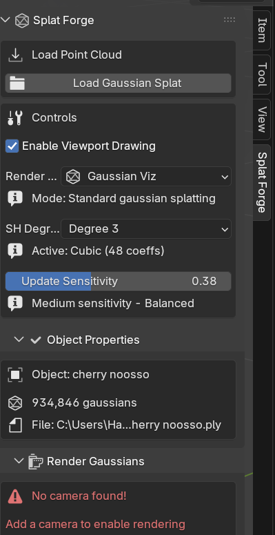
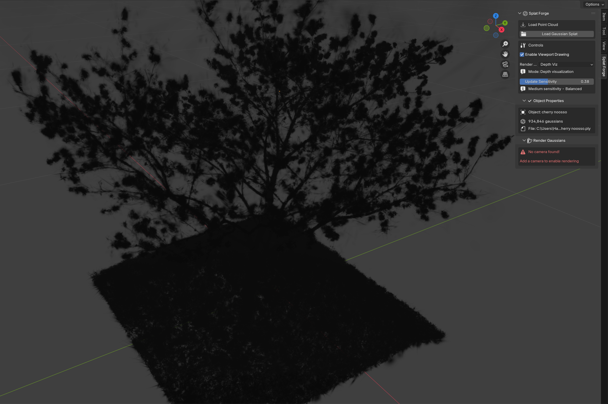
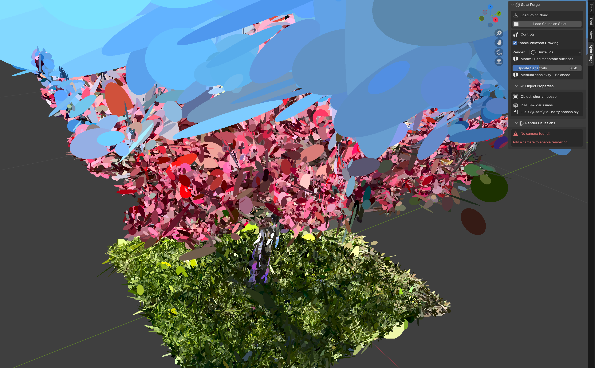
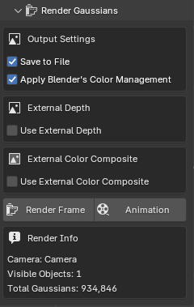
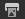
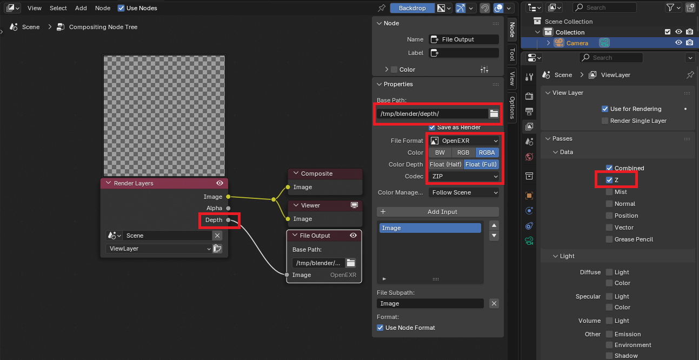
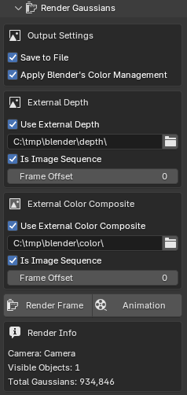
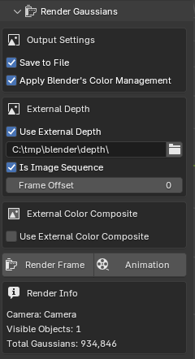

# Splat Forge Documentation
Splat Forge is an addon for using Gaussian Splats (3DGS) natively in Blender. It directly implements these in GLSL, giving native performance. This way your scene can easily handle millions of splats in realtime! It is compatible with both EEVEE and Cycles.

Watch the demo video here: [Youtube Splat Forge Demo](https://youtu.be/ntQnDWQcLt8)

## Install Splat Forge:
- After downloading the zip you can directly go into Blender -> Edit (Top Left) -> Preferences -> Addons -> Arrow in the top right that points down -> Install from disk -> Select the downloaded .zip file

Blender should automatically activate it and you will see a new tab in side panel (N).

## Loading a 3DGS
- Currently SplatForge supports two formats `.splat` and `.ply` (not `.compressed.ply` but that's coming soon!)
- You can either load your file in the 3D Viewport with `Shift + A` → `Gaussian Splat`
- Or in the 3D Viewport on the right side, open the SplatForge tab, at the top `Load Gaussian Splat`
- **Note:** If your splat is large, Blender may "freeze" for a few seconds while loading.

## Working with a Splat
- You can transform the splat like any regular object (translate, rotate, scale) or duplicate with `Shift + D`
- Hiding it in the viewport will only work on the object directly. Disabling the collection the gaussian splat is in, won't work.
- Same goes for `Disable in Viewports` and `Disable in Renders`

### Changing the visualization mode
SplatForge supports 3 different visualization modes. These can also be rendered out.

Gaussian Viz: Proper visualization of the gaussian splats

Depth Viz:

Surfel Viz: Shows all Gaussian splats as ellipse surfels with their original orientation. 

### Spherical Harmonics Degree
SplatForge supports spherical harmonics up to degree 3. You can change the rendering of the entire scene with the SH Degree dropdown. This can be useful if you want to get rid of reconstructed reflections that are camera angle dependent.

### Update Sensitivity
Due to how Gaussian splats are rendered, they need to be sorted or they will look "wrong". This sorting/updating is expensive but required for accurate visualization.
You can adjust the sensitivity of how many times this happens.
- Smaller numbers → fewer updates → scene less accurate
- Larger number → more updates → scene is more accurate
- 0 is the extreme case, you will start seeing artifacts as if you can see through objects but the performance will be better for scenes with several million gaussians
- **Note:** When rendering your scene, SplatForge will always use the most accurate setting.

## Rendering
Due to Blender's Python API limits, Gaussian splat rasterization cannot be directly integrated into the Blender render/composite workflow (F12). Fortunately, there are easy workarounds.

### Rendering without Blender objects
If your scene only consists of Gaussian splats, then you can directly animate your Gaussian splats/camera and render them either with `Render Frame` or `Animation` in the `Render Gaussians` section of the SplatForge tab. In this case, you can turn off external depth and external color composite.

The output path of the render is taken from Blender's `Output`  Tab in the `Properties` Panel. The same you would adjust when outputting regular renders.
SplatForge will always output the color images into the folder `Your/Path/From/The/Settings/sf_color`. It will also output metric scene depth into `sf_depth`.

### Rendering with Blender objects
SplatForge needs to know what the Blender scene looks like when creating the Gaussian splat frame. Many modifiers, Geo Nodes, and textures/shaders will affect an object's geometry. Therefore, SplatForge needs to know the final render shape of the scene not just the viewport representation. For accurate interactions, we need to export this in the form of the `Z-Pass` before we can render the Gaussian splats.

To do this, go in the `Properties` Panel to `View Layer`  and turn on `Z` in Passes -> Data.

Then go to the `Compositing Workspace`, `Use Nodes` and add a `File Output` node to the `Depth` of the `Render Layers` Node. Select the `File Output` Node and go into the node's settings. There, change the base path to your desired location and the file format to `OpenEXR` (other file formats will corrupt the depth).

Now you can render your Blender scene as you are used to (e.g., with F12/Ctrl+F12) and Blender will output the Color/Combined Frames aswell as the depth. 

After the render is finished, go into Blender again and this time, in the SplatForge render settings, turn on `Use External Depth` and `Use External Color Composite`. If you rendered an animation, also tick the `Is Image Sequence` checkbox and select the folder.

Now you can hit the `Render Frame` or `Animation` button. SplatForge will again render to the location set in `Output` . This time there will also be a folder called `sf_composite`, which contains your rendered out Blender scene combined with Gaussian splats.
**Note:** In the case of a animation, SpatForge will search for frame x the image_x.png (other image file types possible) file. If you want to offset this, use `Frame Offset`.

### Rendering with Blender objects and custom compositing
In the above scenario, we let SplatForge do the compositing for us while it was rendering the scene. There are use cases (e.g., color correction, adding camera effects like haze or similar) where you want to do the compositing yourself, either in external programs or Blender.

In this case, we still need to give SplatForge the depth (`Use External Depth`) but not the color. To get the depth, follow the instructions from [Rendering with Blender object](#rendering-with-blender-objects)
- Render animation and depth first to file (Use OpenEXR or depth will be corrupt), then render Gaussian with external depth, then composite together.

If you want, to composite in Blender, a typical set up looks like this

## Other Infos
- Pack into file won't work, but SplatForge will auto-load any SplatForge objects that have been saved (it will remember the file path from where it was initially loaded)
- Because the Gaussian splats are not part of Blender's rendering system but live in OpenGL/Vulkan/GLSL, the objects cannot interact with scene lighting 
  - A solution to this is in the works

## Known Issues
Fixes are on their way!
### Known quirks
#### Reloading
  As the Gaussian objects "live" in the GPU VRAM, certain modifications will require reloading.
  - Duplicating/renaming a Gaussian splat will cause it to be reloaded
  - Deleting a Gaussian splat will cause all remaining Gaussian splats to be reloaded
- Too many Gaussians in the scene will cause stuttering. Try reducing the update rate in the GUI to improve performance. → Will further improve this soon!

### Known Bugs
- There is currently a limit of about 4.5 million Gaussians per scene

The shown Gaussian Splat Model in some of the screenshot is licensed under CC-BY-4.0
https://creativecommons.org/licenses/by/4.0
https://poly.cam/capture/0151341b-647f-4d29-884c-a21566bd4312